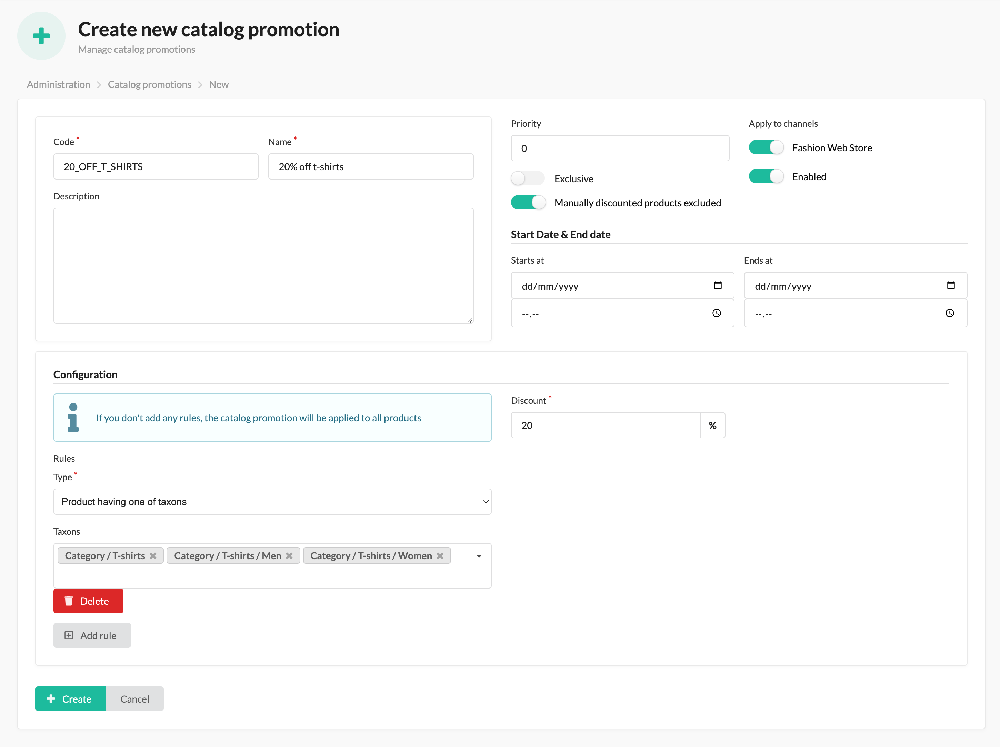

# Sylius Catalog Promotion Plugin

[![Latest Version][ico-version]][link-packagist]
[![Latest Unstable Version][ico-unstable-version]][link-packagist]
[![Software License][ico-license]](LICENSE)
[![Build Status][ico-github-actions]][link-github-actions]

Plugin for Sylius to define permanent or time-limited promotions for products and automatically update prices.



## Install

### Add plugin to composer.json

```bash
composer require setono/sylius-catalog-promotion-plugin
```

**NOTICE** that this plugin uses the `twig/string-extra` and `twig/extra-bundle` internally to do string manipulation in Twig.
It should work out of the box with the Symfony Flex recipe, but if you're not using Symfony Flex, you should install the bundle manually.

### Register plugin

```php
<?php
# config/bundles.php

return [
    // ...
    Setono\SyliusCatalogPromotionPlugin\SetonoSyliusCatalogPromotionPlugin::class => ['all' => true],
    Sylius\Bundle\GridBundle\SyliusGridBundle::class => ['all' => true],
    // ...
];

```

**Note**, that we MUST define `SetonoSyliusCatalogPromotionPlugin` BEFORE `SyliusGridBundle`.
Otherwise, you'll see exception like this:

```bash
You have requested a non-existent parameter "setono_sylius_catalog_promotion.model.promotion.class".  
```

### Add routing

```yaml
# config/routes/setono_sylius_catalog_promotion.yaml
setono_sylius_catalog_promotion:
    resource: "@SetonoSyliusCatalogPromotionPlugin/Resources/config/routes.yaml"
```

### Extend core classes

TODO: Extend `Product` class

### Create migration

```bash
php bin/console doctrine:migrations:diff
php bin/console doctrine:migrations:migrate
```

### Install assets

```bash
bin/console sylius:install:assets
```

### Configure cron (optional)

```bash
# Will process _all_ catalog promotions for _all_ products
# You can run this once a day as a fallback for events triggering the update process
php bin/console setono:sylius-catalog-promotion:process

# Will prune/remove catalog promotion updates older then the given threshold
php bin/console setono:sylius-catalog-promotion:prune-catalog-promotion-updates
```

[ico-version]: https://poser.pugx.org/setono/sylius-catalog-promotion-plugin/v/stable
[ico-unstable-version]: https://poser.pugx.org/setono/sylius-catalog-promotion-plugin/v/unstable
[ico-license]: https://poser.pugx.org/setono/sylius-catalog-promotion-plugin/license
[ico-github-actions]: https://github.com/Setono/SyliusCatalogPromotionPlugin/workflows/build/badge.svg

[link-packagist]: https://packagist.org/packages/setono/sylius-catalog-promotion-plugin
[link-github-actions]: https://github.com/Setono/SyliusCatalogPromotionPlugin/actions
